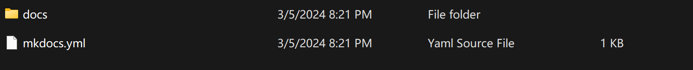

# 2 mkdocs操作文档

## 2.1 安装MKDocs

```
pip install mkdocs
```

## 2.2 生成一个初始化项目

```
mkdocs new test
//test为项目名称
```
会生成如下的文件：

*image2.1 初始化*

**docs里面装的就是markdown文件，yml文件是网页的配置，复杂的功能可用HTML语言书写。**

## 2.4 写markdown
以我们的`SR NJU`为例，文件结构图如下：

theme：

```
pip install mkdocs-material
```

yml怎么写：

```
//网页名字
site_name: SR NJU
//主题名字
theme:
  name: 'material'
//网页结构
nav:
  - 关于我们: index.md
  - 服务器技术文档:
    - 服务器基本信息: 1/1_1.md
    - 环境信息: 1/1_2.md
  - mkdocs操作文档: 2/2.md
  - Python虚拟环境:
    - 预备知识: 3/3_1.md
    - Windows配置虚拟环境: 3/3_2.md
    - 复现THU-DL-SR记录: 3/3_3.md
```

## 2.5 本地预览

```
mkdocs serve
```
可以一开始就打开，一边写一边看网页

## 2.6 部署到GitHub Pages

下载之前的文档：

```
git clone https://github.com/boobyuuuu/SR.git
```

修改自己的文档

将文档上传到master：在上层目录，初始化git，将整个文件夹放入缓存仓库。

```
git init
git add .
git commit -m"update"
```

将site部署到网页deployment:
```
git remote add origin https://github.com/boobyuuuu/SR.git
git push -u origin master
```

```
cd SR-NJU
mkdocs gh-deploy
```
稍等5分钟，就可以了。（如果网页没变不要慌，这个部署比较慢）